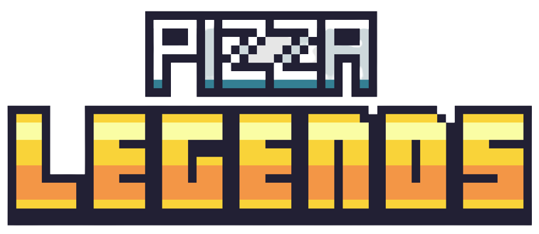

  	
	<h1>RPG</h1>

A simple rpg(Role Playing Game) where you play as a chef, making your way through the world of PIZZA LEGENDS and battling to level up your pizzas!

 

## Where to Play

You can play the game [`here`]. The game is still very much in its early stages and requires active development. See [`contributing`].

[`here`]: https://shyamjayakannan.github.io/rpg
[`contributing`]: #contributing
 

## About

This project was started primarily with the aim of learning Rust, so it borrows from outside resources for graphic elements such as character spritesheets, maps, etc.

Since, I was completely new to rpgs and game development in general, I relied heavily on [`this YouTube Playlist`] to learn how to go about it.

The playlist uses only Javascript, but this project aims to move the canvas rendering logic over to Rust, in order to use its incredibly fast runtime.

[`this YouTube Playlist`]: https://www.youtube.com/playlist?list=PLcjhmZ8oLT0r9dSiIK6RB_PuBWlG1KSq_
 

## How It's made

The code is written partly in [`Rust`] and Vanilla Javascript. No frameworks were used to make the game.

The Rust code was converted to [`WebAssembly`], which provides an API for Javascript to use Rust functions in the browser.

The project uses the [`create-wasm-app`] template, which uses Webpack to bundle the Rust-generated WebAssembly.

[`Rust`]: https://www.rust-lang.org
[`WebAssembly`]: https://webassembly.org
[`create-wasm-app`]: https://github.com/rustwasm/create-wasm-app
 

## Contributing

Contributions are most welcome. Since, this was meant mainly as a practice project, there are many code and non-code ways to contribute to the project.

1. **Reporting a Bug** 
	If you feel something about the gameplay is not as it should be (Ex: maybe you completed a task but no change occurred), please report it in a [`new issue`]. 
2. **Taking the story forward** 
	If you wish to contribute to taking the story forward, open a [`new issue`].
3. **Adding Characters and Maps** 
	If you wish to add characters or maps, please note that each square on the map is 16px × 16px and design them accordingly. All images used are placed in [`web/images`] for your reference.
3. **Change the CodeBase** 
	If you feel the code can be optimized further (which it surely can!), make the changes. Here's how:

	1. Fork the Project
	2. Create your Feature Branch (`git checkout -b feature/AmazingFeature`)
	3. Commit your Changes (`git commit -m 'Add some AmazingFeature'`)
	4. Push to the Branch (`git push origin feature/AmazingFeature`)
	5. Open [`a Pull Request`].

Don't forget to give the project a star! Thanks again!

[`web/images`]: https://github.com/shyamjayakannan/rpg/tree/master/web/images
[`new issue`]: https://github.com/shyamjayakannan/rpg/issues
[`a Pull Request`]: https://github.com/shyamjayakannan/rpg/pulls